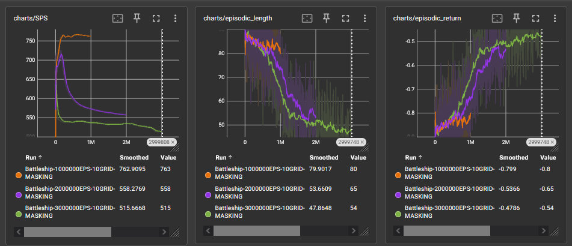

# AI battleship game

## Implementation of the Battleship board game which places the player against an AI model trained via reinforcement learning methods.

The project consists of the code to train an agent to play Battleship as well as a graphical port of the game for the human player to use.

The algorithm used for training is a modified version of the [classic PPO implementation](https://github.com/vwxyzjn/cleanrl/blob/master/cleanrl/ppo.py) from the [CleanRL library](https://github.com/vwxyzjn/cleanrl). It utilises a custom Battleship Gymnasium environment, which takes additional arguments in the training script to set special "difficulty" variations for the agent to learn (or not ^\_^).

The project includes the ability to store and compare agents trained with different rulesets of the game environment, as well as log and monitor training processes via Tensorboard (borrowed from the CleanRL's project repository).

## AI specification

The environment is defined as a 10x10 square grid consisting of tiles, some of which are defined as the "ship" tiles. During every step of a episode the agent chooses one of 100 actions, each representing shooting a specific tile on the grid. The episode ends when all "ship" tiles have been shot, signifying game end.

The reward is a static -0.01 for each action taken, encouraging the agent to complete the episode in the least amount of shots. I found this to work better than giving more specialised rewards based on what the action was, plus it's simpler.

The PPO code is located under /src/ai_battleship/ai/ppo.py, and the environment

### Goals for the agent to learn:

- **Shooting tiles vertically or horizontally adjacent to a successful hit is valuable --> results in a high probability of getting another hit**

  This is the main requirement for the agent to learn in order to play correctly. To achieve this I used a convolutional neural network in order to process the playing grid akin to a low resolution image. The grid is split into 3 channels encoding the following states:

  - Valid shots - unshot fields, can be either empty or contain a ship. These are the tiles that should be targeted by the agent.

  - Hits - shot, but not sunk ship fields. The agent should use them as guides onto which fields to target next (as ship tiles lay together). These tiles however should **not** be targeted by the agent (as repeated shooting of the same tile yields no reward)

  - Everything else - missed shots, sunk ship tiles and optionally tiles surrounding a sunk ship (which are guaranteed to be empty, effectively being the same as misses). Similiar to the hits, these tiles should also **not** be targeted by the agent.

- **Repeated shooting of the same field is unwanted --> no valuable reward \[optional\]**

  Whether the ai has to learn this rule is dependant on one of the two "difficulty" settings. Passing the **--allow-repeated-shots** argument with a value of '1' (True) allows the agent (and player) to repeatedly target the same tile, meaning the agent needs to learn to avoid doing so. This might result in very low rewards in the early training stages, as the agent might waste hundreds of shots on already targeted fields.

- **Shooting the neighboring tiles of a sunk ship is unwanted --> guaranteed to be unsuccesful \[optional\]**

  This is the second rule of which whether the ai has to learn is dependant on the "difficulty" settings: passing the **--mark-sunk-neighbors** argument with a value of '1' (True) automatically marks the neighboring tiles of a sunk ship as misses, which blocks / discourages the agent from targeting them. Disabling this results in a slightly harder task for the agent.

The default values for difficulty arguments are both '0', mimicking the standard Battleship board game rules. This means the agent won't target already shot fields, but has to learn avoiding shooting sunken tile neighbors.

## Setup

As the main training loop is taken from CleanRL's repository, most of the dependencies are also shared.

Main requirement is **Python version >=3.7.1,<3.11**, after that the easiest way to setup is via uv:

```
uv venv
uv pip install -e .
```

should prepare the virtual environment with all the dependencies ready.

(in the future i might try to update the code to make it compatible with newer Python, for now stick to the older versions)

## Usage

Both train_agent.py and start_game.py accept the same command line arguments:

- **--episodes** (default = 3000000) - number of episodes used to train the agent

- **--allow-repeated-shots** (boolean 0/1, default = 0) - first difficulty setting, indicates whether the agent (and the player) can target the same tile multiple times.

- **--mark-sunk-neighbors** (boolean 0/1, default = 0) - second difficulty setting, indicates whether the tiles surrounding the sunk ships are automatically marked as empty / misses

**Training the agent:**

```
python train_agent.py [arguments]
```

runs the training loop, saving the trained model to the models/ directory upon finishing, and creates a log entry in the runs/ directory.

**Starting the game:**

```
python start_game.py [arguments]
```

checks if a model file trained on the specific argument configuration is present, and if found, starts the game.

Controls:

- arrow keys / 'hjkl' to move cursor
- 'space' to place ship / shoot target
- 'r' to rotate ship during setup

**Access Tensorboard training log data:**

```
tensorboard --logdir runs
```

## Training results

Before digging into the results of training I recommend looking into this [short blog post](https://mattfife.com/?p=5252) about the expected results for a Battleship game played by a human player utilising various strategies. The most optimal strategy using a probability map + hunting method + parity searching seems to require on average 42 moves for the player to win.

Here are the results I received for a standard 10x10 grid with 5 ships (default Battleship setup)

**Relationship between amount of episodes used during training and average shot count observed during the ending of the training process:**

- 1 million - 70
- 2 million - 55
- 3 million - 48

**Crude screenshot from the Tensorboard panel:**



This was tested with both shot masking (no repeated shots), and empty tile highlight (tiles neighboring sunk ship are highlighted for the agent as guaranteed misses) enabled, so with all the extra "difficulty" settings disabled, which means the agent had the least amount of rules to learn by itself. Enabling any of these rules would result in much worse performance at the start and slighlty worse results at the ending, but overall the agent seems to learn all scenarios pretty well.

I didn't try using episode count higher than 3 million due to quite the long time taken by the training process, but I think the average result of 48 shots is pretty close to the optimum amount of 42 measured in the linked post, so I'm pretty happy with the outcome.

## TODO:

I might try adding a JAX-compatible variant of the environment and make it work with [PureJaxRL's PPO implementation](https://github.com/luchris429/purejaxrl/blob/main/purejaxrl/ppo.py) to try to get better training speeds (currently I think it's kind of close to working)

## Citing

[CleanRL's](https://github.com/vwxyzjn/cleanrl) algorithm library and Tensorboard logging implementation:

```
@article{huang2022cleanrl,
  author  = {Shengyi Huang and Rousslan Fernand Julien Dossa and Chang Ye and Jeff Braga and Dipam Chakraborty and Kinal Mehta and João G.M. Araújo},
  title   = {CleanRL: High-quality Single-file Implementations of Deep Reinforcement Learning Algorithms},
  journal = {Journal of Machine Learning Research},
  year    = {2022},
  volume  = {23},
  number  = {274},
  pages   = {1--18},
  url     = {http://jmlr.org/papers/v23/21-1342.html}
}
```

[PureJaxRL's](https://github.com/luchris429/purejaxrl) PPO implementation (currently unused, however some borrowed code is present)

```
@article{lu2022discovered,
    title={Discovered policy optimisation},
    author={Lu, Chris and Kuba, Jakub and Letcher, Alistair and Metz, Luke and Schroeder de Witt, Christian and Foerster, Jakob},
    journal={Advances in Neural Information Processing Systems},
    volume={35},
    pages={16455--16468},
    year={2022}
}
```
