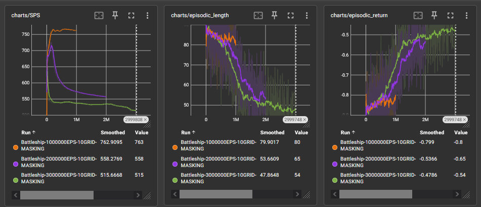

# AI Battleship

## UWAGA: Główny opis projektu znajduje się w pliku [README-MAIN.md](README-MAIN.md), tutaj umieściłem jedynie brakujące punkty zdefiniowane w części sprawozdawczej.

### Podejście

Problem wyuczenia modelu umiejętnie grającego w "statki" rozwiązałem poprzez implementację metod uczenia przez wzmacnianie (reinforcement learning). W głównym README.md projektu opisane zostały uzyskane wyniki, które końcowo całkiem dobrze przybliżają docelowy "optymalny" performance gracza. Jakość modelu ewaluować można poprzez monitoring logów przy użyciu serwisu tensorflow, przedstawiających zmianę wyników uzyskiwanych przez model w trakcie procesu uczenia.

### Opis struktury projektu

Kod źródłowy projektu podzielony jest na moduły, odpowiadające za poszczególne części programu:

- core: definiuje podstawowe elementy gry (plansza, pole)
- game_phases: odpowiada za logikę przebiegu gry
- ai: odpowiada za uczenie agenta

### Przygotowanie

Warunkiem uruchomienia aplikacji jest nieco starsza wersja Pythona **>=3.7.1,<3.11**, przy tym najprościej jest przy użyciu pyenv i uv:

```
pyenv install 3.10
pyenv local 3.10 # in project directory
uv venv
uv pip install -e .
```

### Jak uruchomić?

Ze względu na specyfikację procesu uczenia aplikacja nie posiada skryptów umożliwiających ewaluację agenta, ani skryptów typu download_data.py - dane są generowane na bieżąco w trakcie procesu uczenia, a agent wykonując możliwe czynności - w tym przypadku "strzały" w poszczególne pola - otrzymuje nagrody, na podstawie których dostosowuje swoją metodykę ("policy", w praktyce reprezentowana przez sieć neuronową).

Punktami wejściowymi do uruchomienia programu są pliki train_model.py, służący do wytrenowania modelu w oparciu o odpowiednie zasady gry, i start_game.py, umożliwiające grę przeciwko wytrenowanemu modelowi

Ponieważ wytrenowanie agenta na GPU średniej mocy zajmuje kilkanaście minut, w folderze models/ umieściłem trzy pre-wytrenowane modele wyuczone odpowiednio w czasie 1M, 2M i 3M epizodów.

Główną aplikację uruchamia się skryptem

`python start_game.py`,

który bez dodatkowych argumentów wykorzystuje najbardziej zaawansowany model z trzech wymienionych (3M epizodów treningu).

W celu wytrenowania modelu na innej liczbie epizodów - przykładowo: 10000 -należy użyć komendy:

`python train_model.py --episodes 10000`

Po skończeniu treningu można zagrać przeciwko danemu modelowi poprzez

`python start_game.py --episodes 10000`

### Specyfikacja modelu i technologii

##### Definicja funkcji kosztu

Ponieważ warunkiem zwycięstwa gry w statki jest zatopienie wszystkim statków przeciwnika zanim on zatopi nasze, metrykę tego jak "dobry" jest dany gracz może stanowić średnia ilość strzałów potrzebna do zatopienia każdego z wrogich pól, i ta miara jest używana jako funkcja kosztu.
Za każdy oddany strzał, niezależnie od efektu agent otrzymuje negatywną nagrodę -0.01, przykładowo episod zakończony w 60 strzałów zwróci total reward = -0.60.

(implementacja Tensorflow zapożyczona z biblioteki CleanRL).

#### Implementacja

Środowisko zdefiniowane jest jako dyskretna przestrzeń składająca się z pól o standardowych wymiarach 10x10, gdzie niektóre z pól zdefiniowane są jako pola statków.

Aplikacja wykorzystuje bibliotekę Pytorch, implementując algorytm uczenia przez wzmacnianie PPO (Proximal Policy Optimalization). Główny kod zdefiniowany jest w src/ai_battleship/ai/ppo.py, z główną częścią matematyczną zapożyczoną z biblioteki CleanRL.

#### Środowisko

Środowisko dla agenta zdefiniowane jest w pliku src/ai_battleship/ai/envs/battleship_env.py przy użyciu biblioteki Gymnasium, jako dyskretna przestrzeń składająca się z pól o standardowych wymiarach 10x10, gdzie niektóre z pól zdefiniowane są jako pola statków.

Podczas każdego kroku w epizodzie, agent podejmuje akcję w postaci wyboru jednego z dostępnych pól, symbolizującą oddanie strzału.

Epizod kończy się w momencie gdy agent trafi wszystkie pola statków ("zatopi wszystkie statki").

#### Sieć neuronowa

Agent reprezentowany jest przez sieć neuronową. Architektura obejmuje 2 konwolucyjne sieci neuronowe (CNN), wraz z dwoma funkcjami aktywacji ReLU oraz optymalizatorem Adam.

Na wejściu agent otrzymuje tensor o wymiarach 10x10x3, gdzie wymiary reprezentują odpowiednio wysokość planszy, szerokość planszy i rodzaj pola zapisany w postaci one-hot encoding (zdefiniowane są 3 rodzaje).

Na wyjściu jest integer, reprezentujący pole wybrane przez agenta do strzału.

### Ewaluacja i logging wyników

Średnia nagroda uzyskiwana w procesie uczenia służy również za miarę postępów agenta przy ewaluacji, jej zmianę monitorować można za pomocą serwisu tensorflow komendą:

`tensorflow --logdir runs`

**Przykładowy screenshot z panelu Tensorboard**



Główną interesującą nas wartością jest episodic_return, długość epizodu jest przeciwieństwem nagrody, SPS to steps per second, nie są szczególnie istotne do interpretacji końcowego wyniku.

Warto zwrócic uwagę na fakt że nagroda (episodic_return)zawsze będzie negatywna, ze względu na to że agent zaczyna od 0 i traci -0.01 za każdy strzał.
W tym wypadku najlepszy możliwy wynik wynosi -0.17 (w sytuacji gdzie agent ani razu nie spudłuje), [przybliżony wynik optymalnego gracza wynosi -0.42](https://mattfife.com/?p=5252), a najgorszy wynik wynosi -1 (w sytuacji gdy agent strzeli w każde pole na planszy).